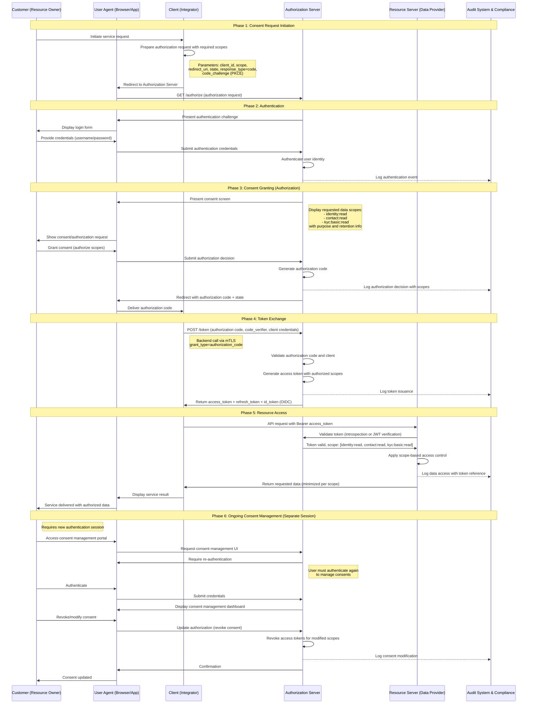
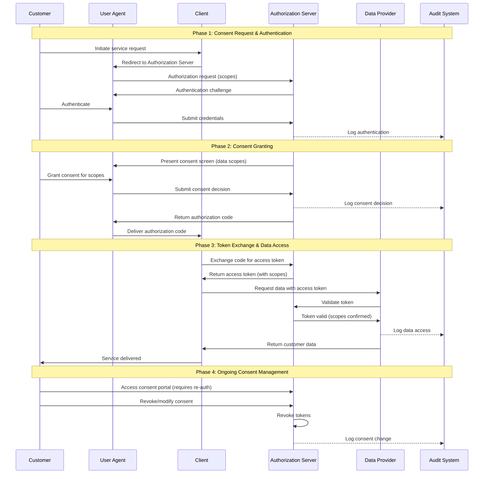
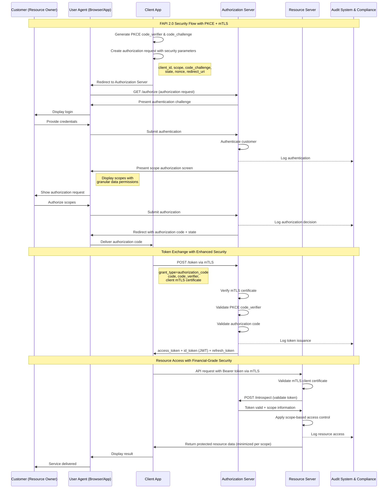
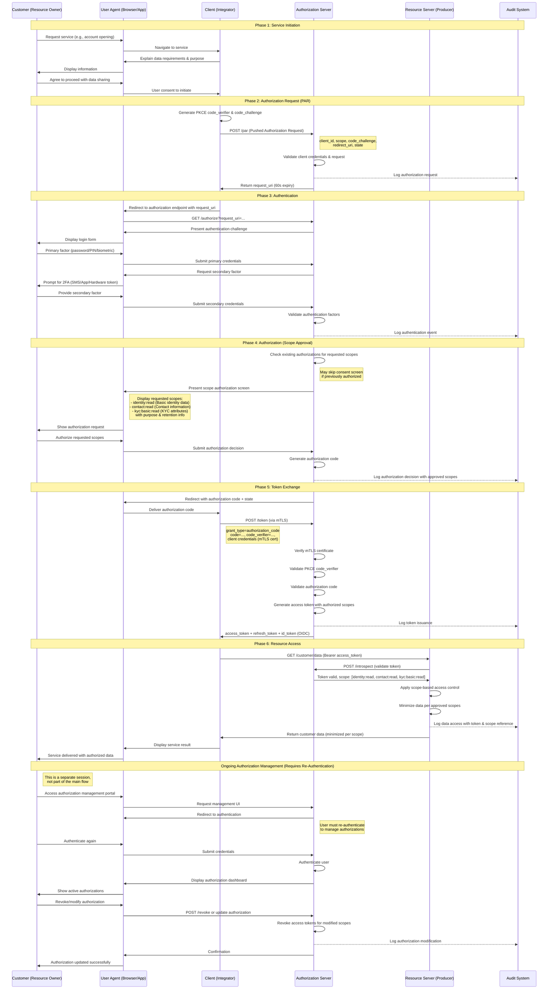
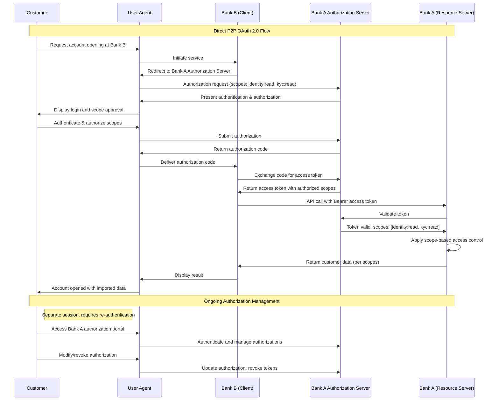
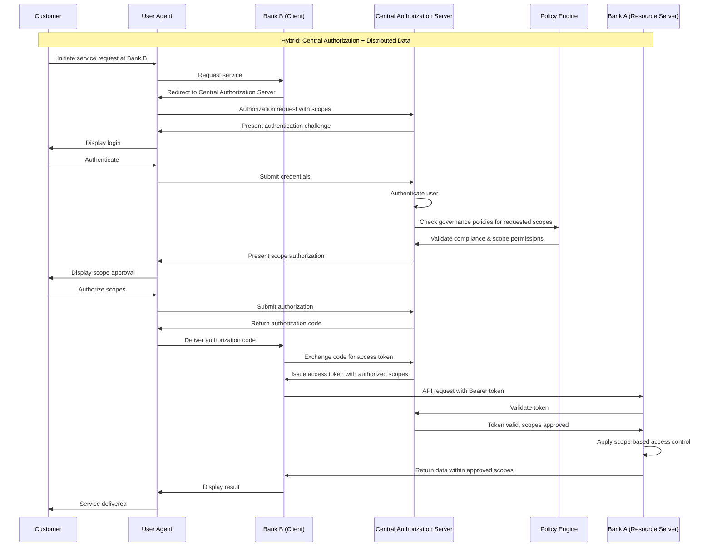

# OBP Consent und Security Flow Conclusion

## Inhalt

1. [Executive Summary](#executive-summary)
2. [Grundlagen und Scope des Security-Frameworks](#grundlagen-und-scope-des-security-frameworks)
3. [Security Standards Evaluation](#security-standards-evaluation)
4. [Consent-Flow-Architekturen](#consent-flow-architekturen)
5. [JWT-Token Architektur und Consent Claims](#jwt-token-architektur-und-consent-claims)
6. [Begründete Standard-Auswahl: FAPI 2.0, OAuth2, OIDC](#begründete-standard-auswahl-fapi-20-oauth2-oidc)
7. [Consent und Security Flow Implementation](#consent-und-security-flow-implementation)
8. [Integration Patterns](#integration-patterns)
9. [Compliance und Regulatory Alignment](#compliance-und-regulatory-alignment)
10. [Fazit und Roadmap](#fazit-und-roadmap)

---

## Executive Summary

Das Consent und Security Flow Framework etabliert eine FAPI 2.0-konforme Security-Architektur für Open API Kundenbeziehung, die generisch und unabhängig vom gewählten Vertrauensnetzwerk-Modell funktioniert. Das Framework basiert auf bewährten Standards (FAPI 2.0, OAuth 2.0, OpenID Connect) und bietet robuste Sicherheitsmechanismen mit granularer Consent-Verwaltung.

**Zentrale Designprinzipien:**
- Network-agnostisches Security Framework für alle Architektur-Modelle
- FAPI 2.0 compliance für Financial-grade API Security
- Granulare Consent-Management mit Customer Control
- Sequence Diagram-basierte Implementation für Business Stakeholder Verständnis

---

## Grundlagen und Scope des Security-Frameworks

### Generisches Security-Framework

**Network Agnostic Design:** Das Security Framework funktioniert unabhängig von der gewählten Vertrauensnetzwerk-Architektur:
- **Dezentral:** Direkte P2P Security zwischen Partnern
- **Hybrid:** Zentrale Standards mit dezentraler Security-Implementation  
- **Zentral:** Hub-basierte Security mit zentraler Policy Enforcement

**Universal Application Scope:** Einheitliche Security für alle Use Cases:
- Bankkonten-Onboarding mit KYC-Level Security
- Re-Identifikation mit minimaler Data Exposure
- Altersverifikation mit Attribute-based Consent
- Cross-Industry Services mit Purpose-based Access Control

### Bezug auf Vertrauensnetzwerk-Rollen

**Integration mit Vertrauensnetzwerk-Rollen aus [05 Vertrauensnetzwerk](./05%20Vertrauensnetzwerk.md):**

#### Data Producer Security Role
- **Authentifizierung:** Customer-facing Authentication Services
- **Autorisierung:** Granular Data Access Control basierend auf Consent
- **Compliance:** Audit Trail und Data Protection Enforcement

#### Data Consumer Security Role  
- **Client Authentication:** Mutual TLS und Client Credentials Management
- **Token Management:** Secure Access Token und Refresh Token Handling
- **Data Protection:** Purpose-based Data Processing mit Privacy Controls

#### Trust Anchor Security Role
- **PKI Management:** Certificate Authority Services für Mutual TLS
- **Policy Enforcement:** Central Security Policies mit Federation Support
- **Compliance Monitoring:** Security Audit und Incident Response

### Security Component Architecture

**Konzeptionelle Sicherheitsarchitektur:**

Die Security-Komponenten sind in einer hierarchischen Schicht-Architektur organisiert:

**Customer Authentication Layer**
↓
**Authorization Server (FAPI 2.0)**
↓
**Consent Management Engine**
↓
**API Gateway & Security Enforcement**
↓
**Data Producer APIs**

**Architektur-Fluss:** Jede Schicht baut auf der vorhergehenden auf und bietet spezialisierte Sicherheitsfunktionalitäten. Der Datenfluss erfolgt top-down von der Kundenauthentifizierung bis zu den produktiven APIs, wobei jede Ebene zusätzliche Sicherheits- und Compliance-Kontrollen implementiert.

**Component Responsibilities:**
- **Customer Authentication:** Multi-Factor Authentication mit Swiss E-ID Integration
- **Authorization Server:** OAuth 2.0/OIDC mit FAPI 2.0 Extensions
- **Consent Engine:** Granular Consent mit Purpose Limitation und Revocation
- **API Gateway:** Rate Limiting, Threat Detection, Audit Logging
- **Producer APIs:** Resource Server mit Token Validation und Data Minimization

---

## Security Standards Evaluation

### Standards aus Marktanalyse Review

**Basierend auf [01 Marktanalyse](./01%20Marktanalyse.md) identifizierte Standards:**

#### FAPI (Financial-grade API) Evaluation

**FAPI 1.0 Baseline:**
- **Adoption:** UK Open Banking, Singapore SGFINEX (teilweise)
- **Security Level:** Medium - suitable für Low-Risk Account Information
- **Vorteile:** Etabliert, breite Tool-Unterstützung, einfachere Implementierung  
- **Nachteile:** Begrenzte Sicherheit für High-Value Transaktionen

**FAPI 1.0 Advanced:**
- **Adoption:** Brasil Open Finance, Australia CDR (mandatory)
- **Security Level:** High - suitable für Payment Initiation und Sensitive Data
- **Vorteile:** Bewährt in der Produktion, umfassende Sicherheitskontrollen
- **Nachteile:** Komplexe Implementierung, höhere Entwicklungskosten

**FAPI 2.0 (Current Recommendation):**
- **Adoption:** Emerging Standard, Expert-recommended für neue Implementations
- **Security Level:** Very High - Next Generation Financial API Security
- **Vorteile:** Modernste Sicherheit, vereinfachte Entwicklererfahrung, zukunftssicher
- **Nachteile:** Neuerer Standard, derzeit begrenzte Tool-Unterstützung

#### OAuth 2.0/2.1 und OpenID Connect Evaluation

**OAuth 2.0:**
- **Universal Adoption:** Alle analysierten Standards verwenden OAuth 2.0
- **Maturity:** Etablierter Standard mit umfassendem Ecosystem
- **Swiss Context:** FAPI 2.0 baut auf OAuth 2.1 auf (Enhanced Security)

**OpenID Connect:**
- **Identity Layer:** Standardisierte Identity Claims für Customer Information
- **Integration:** Seamless Integration mit E-ID durch OIDC Claims
- **Multi-Factor:** Native Support für MFA und Step-up Authentication

### Detailed Security Standards Comparison

| Standard | Security Level | Implementation Complexity | Tool Support | Future-Proof |
|----------|----------------|---------------------------|---------------|--------------|
| **OAuth 2.0 Basic** | Medium | Low | Excellent | Limited |
| **FAPI 1.0 Baseline** | High | Medium | Good | Moderate |
| **FAPI 1.0 Advanced** | Very High | High | Moderate | Good |
| **FAPI 2.0** | Maximum | Medium-High | Limited | Excellent |

**Empfehlung:** FAPI 2.0 für neue Implementierung mit Fallback zu FAPI 1.0 Advanced für Legacy Integration

---

## Consent-Flow-Architekturen

### Terminologie-Abstimmung

Die folgende Tabelle verdeutlicht die Zuordnung zwischen OAuth 2.0/OIDC technischen Begriffen und Business/DSGVO-Terminologie:

| OAuth 2.0 / OIDC Begriff | Beschreibung | DSGVO / Business Begriff |
|----------------------|-------------|---------------------|
| Authorization Server | Stellt Tokens nach Authentifizierung und Autorisierung aus | Consent Platform |
| Client | Anwendung, die im Namen des Benutzers Zugriff anfordert | Service Provider / Integrator |
| Resource Owner | Benutzer, der Zugriff auf seine Daten gewährt | Betroffene Person / Kunde |
| Resource Server | API, die Benutzerdaten schützt | Datenverantwortlicher / Data Provider |
| Scope | Technische Zugriffsberechtigungen, die API-Zugriff definieren | Datenkategorien |
| Authorization | Benutzer gewährt Zugriff auf angeforderte Scopes | Einwilligung |
| Access Token | Zugangsberechtigung für API-Zugriff | - |
| ID Token (OIDC) | Nachweis der Authentifizierung mit Benutzer-Claims | - |
| User Agent | Browser oder Mobile App als Vermittlungsinstanz | - |

**Hinweis:** In diesem Dokument bezieht sich "Consent" auf die Benutzerautorisierung gemäß DSGVO-Anforderungen, während OAuth "Scope" technische Zugriffsberechtigungen definiert. Diese Konzepte sind aufeinander abgestimmt, verwenden jedoch unterschiedliche Terminologie in ihren jeweiligen Kontexten.

### Flow-Voraussetzungen

Vor der Initiierung des OAuth 2.0 Authorization Code Flow müssen folgende Voraussetzungen erfüllt sein:

**Client-Registrierung:**
- Client-Anwendung beim Authorization Server registriert
- Client-Credentials ausgestellt (client_id, client_secret oder X.509-Zertifikat)
- Redirect-URIs vorregistriert und validiert
- Erlaubte Scopes für den Client konfiguriert

**Benutzervoraussetzungen:**
- Benutzer hat aktives Konto beim Resource Provider
- Benutzer-Credentials für Authentifizierung eingerichtet
- Benutzer hat verifizierte Kontaktinformationen für Benachrichtigungen

**Technische Konfiguration:**
- TLS/mTLS-Zertifikate für sichere Kommunikation konfiguriert
- PKCE-Unterstützung für erhöhte Sicherheit aktiviert
- Token-Endpoint-Authentifizierungsmethode konfiguriert
- Scopes gemäß OpenID Connect Spezifikation definiert und dokumentiert

**Infrastruktur:**
- User Agent (Browser/Mobile App) für Redirect-basierten Flow verfügbar
- Netzwerkkonnektivität zwischen allen Komponenten
- Audit-Logging-Infrastruktur operativ

### Generischer Consent Management Flow (OAuth 2.0-basiert)

Dieser Flow demonstriert, wie Kundeneinwilligung beim Datenaustausch zwischen Providern im Open API Kundenbeziehung-Netzwerk verwaltet wird. Die Implementierung folgt OAuth 2.0 Authorization Code Flow Standards und adressiert gleichzeitig die spezifischen Anforderungen an Kundendatenaustausch und Consent Management.

**Business Context:**
- **Szenario**: Kunde möchte seine bestehenden Daten (gehalten vom Data Provider) mit einem neuen Service (Client) nutzen
- **Consent-Anforderung**: Kunde muss explizit autorisieren, welche Daten-Scopes geteilt werden
- **Technische Implementierung**: OAuth 2.0 Authorization Code Flow mit PKCE
- **Compliance**: DSGVO-Einwilligungsanforderungen gemappt auf OAuth 2.0 Authorization Scopes



### Vereinfachter Consent Management Flow

Für einen High-Level-Überblick zeigt diese vereinfachte Version die wesentlichen Schritte unter Beibehaltung der OAuth 2.0-Konformität. Für vollständige Implementierungsdetails siehe den detaillierten Flow oben.




### Übersicht existierender Consent-Flow-Modelle

#### App-to-App Redirect Flow (UK Standard)
**Konzeptionelle Architektur:**

Der App-to-App Flow ermöglicht native Mobile Experience ohne Browser-Umleitung:

**Customer App** → **Bank App** → **Customer App (with consent)**

**Flow-Charakteristika:**
- **Phase 1:** Customer startet Service in Integrator App
- **Phase 2:** Automatische Weiterleitung zur Bank App
- **Phase 3:** Authentifizierung und Consent in nativer Bank App
- **Phase 4:** Rückleitung zur Integrator App mit Authorization Code

**Vorteile:**
- Native Mobile Experience mit optimaler UX
- Keine Browser-Umleitung erforderlich
- Starke Customer Authentication durch Bank App

**Nachteile:**
- Erfordert installierte Bank Apps
- Platform-spezifische Implementation (iOS/Android)
- Begrenzte Cross-Platform Kompatibilität

**Use Cases:** Ideal für Mobile-First Customer Journeys mit hoher App-Adoption

#### Browser Redirect Flow (PSD2 Standard)
**Konzeptionelle Architektur:**

Der Browser Redirect Flow nutzt Standard-Web-Mechanismen für universelle Kompatibilität:

**Customer Browser** → **Authorization Server** → **Customer Browser (with code)**

**Flow-Charakteristika:**
- **Phase 1:** Customer startet Service im Browser
- **Phase 2:** Redirect zum Authorization Server
- **Phase 3:** Authentifizierung und Consent im Authorization Server
- **Phase 4:** Redirect zurück mit Authorization Code

**Vorteile:**
- Universal Browser-Kompatibilität
- Keine App-Installation erforderlich
- Einfachste Implementation für Web Services

**Nachteile:**
- Potentielle UX-Brüche durch Redirects
- Browser Security Limitations
- Mobile Experience oft suboptimal

**Use Cases:** Web-basierte Services, Legacy System Integration

#### Decoupled Flow (Brasil Model)
**Konzeptionelle Architektur:**

Der Decoupled Flow ermöglicht Multi-Device Authentication für höchste Sicherheit:

**Customer Device 1** → **Authorization** + **Customer Device 2** → **Consent Completion**

**Flow-Charakteristika:**
- **Phase 1:** Customer startet Service auf Device 1
- **Phase 2:** Push Notification oder QR Code für Device 2
- **Phase 3:** Authentifizierung und Consent auf Device 2
- **Phase 4:** Completion Notification an Device 1

**Vorteile:**
- Flexible Multi-Device Authentication
- Enhanced Security durch Device Separation
- Support für verschiedene Customer Contexts

**Nachteile:**
- Höhere Komplexität für Customers
- Zusätzliche Infrastructure Requirements
- Complex Error Handling

**Use Cases:** High-Security Scenarios, Multi-Device Customer Environments

### Consent Granularity Models


#### Field-Level Granular Consent
**Definition:** Customer kann spezifische Datenfelder individual freigeben
```json
{
  "consent": {
    "identity.name": true,
    "identity.dateOfBirth": false,
    "contact.email": true,
    "kyc.income": false
  }
}
```

**Vorteile:** Maximale Kundenkontrolle, Privacy-by-Design
**Nachteile:** Komplexe UX, potenziell überwältigend für Kunden

#### Category-Based Consent  
**Definition:** Consent auf Datenkategorie-Ebene (Identity, Contact, Financial)
```json
{
  "consent": {
    "identity": "full",
    "contact": "basic", 
    "financial": "denied"
  }
}
```

**Vorteile:** Ausgewogene UX und Datenschutz, handhabbare Komplexität
**Nachteile:** Weniger granular als Field-Level Control

#### Purpose-Based Consent
**Definition:** Consent basierend auf Nutzungszweck
```json
{
  "consent": {
    "purpose": "account_opening",
    "scope": "identity+contact+kyc_basic",
    "duration": "account_lifetime"
  }
}
```

**Vorteile:** Kundenverständlicher Ansatz, rechtliche Compliance
**Nachteile:** Weniger Flexibilität bei Data Access Patterns

### Recommended Hybrid Consent Approach

**Multi-Layer Consent Strategy:**
1. **Primary Layer:** Purpose-Based Consent für Customer Understanding
2. **Secondary Layer:** Category-Based Granularity für Privacy Control  
3. **Advanced Layer:** Field-Level Control für Power Users (optional)

**Vorteile:**
- Berücksichtigt verschiedene Customer Sophistication Levels
- Legal Compliance durch Purpose Limitation
- Skalierbar für verschiedene Use Cases

---

## Standards Compliance und Implementierungs-Referenzen

### OAuth 2.0 und OpenID Connect Standards

Diese Implementierung folgt etablierten Industriestandards für sichere Autorisierung und Authentifizierung:

**OAuth 2.0 Authorization Framework (RFC 6749)**
- **Authorization Code Grant**: Primärer Flow für Server-seitige Anwendungen
- **Spezifikation**: IETF RFC 6749 - The OAuth 2.0 Authorization Framework
- **Kernfunktionen**: Redirect-basierter Flow mit Authorization Code Exchange für Access Tokens
- **Security Extensions**: PKCE (RFC 7636) für erhöhte Sicherheit gegen Authorization Code Interception Attacks

**OpenID Connect Core 1.0**
- **Authentication Layer**: Aufbauend auf OAuth 2.0, fügt Authentifizierungsfähigkeiten hinzu
- **Spezifikation**: https://openid.net/specs/openid-connect-core-1_0.html#CodeFlowAuth
- **ID Token**: JWT mit Authentifizierungs-Claims über den Endbenutzer
- **Standard Scopes**: openid (erforderlich), profile, email, address, phone
- **Kernunterscheidung**: Trennt Authentifizierung (Identitätsnachweis) von Autorisierung (Zugriffsgenehmigung)

**PKCE (Proof Key for Code Exchange) - RFC 7636**
- **Zweck**: Schützt Authorization Code Flow vor Interception Attacks
- **Mechanismus**: Code Challenge/Verifier Paar verhindert Code Substitution
- **Empfehlung**: Mandatory für alle Clients, einschließlich Confidential Clients

### Standards Alignment Zusammenfassung

| Standard | Version | Zweck | Implementierungsstatus |
|----------|---------|---------|----------------------|
| OAuth 2.0 | RFC 6749 | Authorization Framework | Vollständige Compliance |
| PKCE | RFC 7636 | Code Flow Security | Mandatory |
| OpenID Connect | Core 1.0 | Authentication Layer | Vollständige Unterstützung |
| FAPI 2.0 | Draft | Financial-grade Security | Ziel-Implementierung |
| mTLS | RFC 8705 | Client Authentication | Unterstützt |
| JWT | RFC 7519 | Token Format | Access & ID Tokens |

### Architektonische Implementierungshinweise

**Authorization Server Verantwortlichkeiten:**
- Benutzerauthentifizierung (Credentials-Validierung)
- Autorisierungsmanagement (Scope-Genehmigung)
- Token-Ausstellung (Access, Refresh, ID Tokens)
- Token-Introspection und Revocation
- Autorisierungs-Lifecycle-Management

**Hinweis zum Consent Management:**
Gemäß bLink-Referenzarchitektur kann der Authorization Server die Consent-Speicherung an einen spezialisierten Consent Server delegieren, während er die Kontrolle über den Authorization Flow behält. Dies ist ein Implementierungsdetail, das die OAuth 2.0 Flow-Struktur nicht beeinflusst.

**Security Best Practices:**
- Immer PKCE für Authorization Code Flow verwenden
- mTLS für Confidential Client Authentication implementieren
- Kurzlebige Access Tokens mit Refresh Token Rotation verwenden
- Alle Redirect URIs gegen vorregistrierte Werte validieren
- Umfassendes Audit Logging für alle Authorization Events implementieren
- Rate Limiting zur Missbrauchsprävention anwenden

---

## JWT-Token Architektur und Consent Claims

### JWT Token Architektur & Claims



```mermaid
graph TB
    subgraph "JWT Token Structure"
        Header[Header<br/>alg: RS256<br/>typ: JWT<br/>kid: key-id]
        Payload[Payload<br/>Standard Claims<br/>Custom Claims<br/>Consent Claims]
        Signature[Signature<br/>RSA256<br/>Private Key Signed]
    end
    
    subgraph "Standard Claims"
        ISS[iss: issuer]
        SUB[sub: subject]  
        AUD[aud: audience]
        EXP[exp: expiration]
        IAT[iat: issued at]
        JTI[jti: JWT ID]
    end
    
    subgraph "Consent Claims"
        PURPOSE[purpose: account_opening]
        SCOPE[scope: basic_data kyc_data]
        CUSTOMER[customer_hash: sha256_hash]
        CONSENT_ID[consent_id: unique_id]
        CONSENT_EXP[consent_expires: timestamp]
    end
    
    subgraph "Custom Claims"
        INSTITUTION[requesting_institution: bank_id]
        USE_CASE[use_case: customer_onboarding]
        DATA_RETENTION[data_retention_period: duration]
        PROCESSING_PURPOSE[processing_purpose: specific_purpose]
    end
    
    Header --> Payload
    Payload --> Signature
    
    Payload --> ISS
    Payload --> SUB
    Payload --> AUD
    Payload --> EXP
    Payload --> IAT
    Payload --> JTI
    
    Payload --> PURPOSE
    Payload --> SCOPE
    Payload --> CUSTOMER
    Payload --> CONSENT_ID
    Payload --> CONSENT_EXP
    
    Payload --> INSTITUTION
    Payload --> USE_CASE
    Payload --> DATA_RETENTION
    Payload --> PROCESSING_PURPOSE
    
    classDef header fill:#e3f2fd
    classDef standard fill:#f3e5f5
    classDef consent fill:#e8f5e8  
    classDef custom fill:#fff3e0
    
    class Header,Signature header
    class ISS,SUB,AUD,EXP,IAT,JTI standard
    class PURPOSE,SCOPE,CUSTOMER,CONSENT_ID,CONSENT_EXP consent
    class INSTITUTION,USE_CASE,DATA_RETENTION,PROCESSING_PURPOSE custom
```

### JWT Access Token Structure

**Standard JWT Claims für Open API Kundenbeziehung:**
```json
{
  "iss": "https://auth.obp.ch",
  "sub": "customer_hash_sha256",
  "aud": ["https://api.bank-a.ch", "https://api.bank-b.ch"],
  "exp": 1724000000,
  "iat": 1723996400,
  "jti": "unique_token_id_12345",
  "scope": "identity:read contact:read kyc:basic",
  "client_id": "fintech_app_123"
}
```

### Custom Consent Claims Definition

**OBP-Specific Claims für Enhanced Consent Management:**
```json
{
  "consent": {
    "id": "consent_abc123",
    "purpose": "account_opening", 
    "granted_at": 1723996400,
    "expires_at": 1756532400,
    "data_categories": ["identity", "contact", "kyc_basic"],
    "granular_permissions": {
      "identity.name": "read",
      "identity.dateOfBirth": "read",
      "contact.email": "read_write",
      "kyc.income_range": "read"
    }
  },
  "data_retention": {
    "policy": "customer_lifetime",
    "deletion_request": false,
    "last_activity": 1723996400
  },
  "audit": {
    "consent_method": "explicit_opt_in",
    "consent_interface": "mobile_app_v2.1",
    "customer_ip": "192.168.1.100",  
    "legal_basis": "consent_art6_1a_gdpr"
  }
}
```

**API Data Structures Integration:** These consent claims integrate with the modular data structures → [See complete API data schemas and structures in Conclusion 04 API Endpoint Design](./04%20API%20Endpoint%20Design.md#datenpunkte--modulare-datenbausteine-version-20)

### Refresh Token und Long-Lived Consent

**Refresh Token Strategy:**
```json
{
  "refresh_token": {
    "id": "refresh_xyz789",
    "consent_id": "consent_abc123",
    "expires_at": 1756532400,
    "revocation_endpoint": "/consent/revoke",
    "customer_controls": "/consent/manage"
  }
}
```

**Long-Lived Consent Management:**
- **Initial Consent:** Definierte Gültigkeitsdauer
- **Renewal Mechanism:** Automatic mit Customer Notification
- **Revocation Rights:** 24/7 Customer Self-Service
- **Activity Monitoring:** Automatic Expiry bei längeren Inaktivitätsperioden

---

## Begründete Standard-Auswahl: FAPI 2.0, OAuth2, OIDC

### Auswahl basierend auf Marktanalyse

**Marktanalyse Erkenntnisse aus [01 Marktanalyse](/documentation/Fachliche%20Conclusions%20Open%20API%20Kundenbeziehung/01%20Marktanalyse.md):**
- 7 von 8 Standards nutzen OAuth 2.0 als Basis
- FAPI wird zunehmend mandatory in regulierten Märkten
- OIDC ermöglicht nahtlose E-ID Integration

### Experten-Verifikation und Autoritäre Quellen

**Security Expert Consensus:**
- **FAPI 2.0:** Recommended für neue Financial API Implementations
- **OAuth 2.1:** Solid Foundation mit Enhanced Security über OAuth 2.0
- **OIDC:** Essential für Identity Federation und E-ID Integration

**Autoritäre Spezifikationen und Referenzen:**
- **OpenID Connect Core 1.0:** https://openid.net/specs/openid-connect-core-1_0.html#CodeFlowAuth
- **OAuth 2.0 Authorization Framework:** IETF RFC 6749
- **FAPI 2.0 Security Profile:** OpenID Foundation Specification
- **GDPR Compliance Guidelines:** EU Data Protection Regulation

**Technical Expert Input:**
- FAPI 2.0 vereinfacht Implementation vs. FAPI 1.0 Advanced
- Community Support für FAPI 2.0 steigt kontinuierlich

### Swiss Context Specific Rationale

**Regulatory Alignment:**
- **FINMA Compatibility:** FAPI 2.0 exceeds FINMA Security Expectations
- **EU Equivalence:** Compatible mit PSD2/PSD3 Security Requirements
- **E-ID Integration:** OIDC Claims mapping für Swiss E-ID Attributes

**Technical Advantages:**
- **Developer Experience:** Simplified Integration vs. proprietary Approaches
- **International Compatibility:** Seamless Integration mit EU/UK Systems
- **Future-Proof:** Anticipated Standard für next-generation Financial APIs

**Risk Mitigation:**
- **Security-by-Design:** FAPI 2.0 beinhaltet lessons learned from FAPI 1.0
- **Compliance-Ready:** Built-in Support für GDPR, PSD2, DSG Requirements
- **Audit-Friendly:** Comprehensive Logging und Monitoring Integration

---

## Consent und Security Flow Implementation

### FAPI 2.0 Security Implementation



### Authentication/Authorization Sequence

**Complete Authentication Flow für Business Stakeholders:**

#### Phase 1: Customer Initiation
```
1. Customer accesses Integrator Service
2. Integrator explains data requirements transparently  
3. Customer consents to data sharing purpose
4. System generates secure session (PKCE)
```

#### Phase 2: Authorization Request (PAR)
```
5. Integrator submits Pushed Authorization Request
   - Client credentials validation
   - Purpose and scope specification  
   - PKCE challenge transmission
6. Authorization Server validates request
7. Authorization Server returns request_uri (60 sec expiry)
```

#### Phase 3: Customer Authentication
```  
8. Customer redirected to Authorization Server
9. Strong Customer Authentication (SCA) required:
   - Primary factor: Password/PIN/Biometric
   - Secondary factor: SMS/App/Hardware Token
10. Optional: E-ID integration für enhanced verification
```

#### Phase 4: Authorization (Scope Approval)
```
11. Authorization Server checks for existing authorizations
12. Authorization Server presents scope authorization screen via User Agent:
    - Clear explanation of requested scopes and data access purpose
    - Granular scope selection (e.g., identity:read, contact:read, kyc:basic:read)
    - Duration and retention policy information
13. Customer authorizes/denies requested scopes via User Agent
14. Authorization decision recorded with audit trail
```

#### Phase 5: Token Exchange
```
15. Authorization code issued to User Agent (short expiry, single-use)
16. User Agent delivers authorization code to Client
17. Client exchanges authorization code for tokens via backend call:
    - POST /token with authorization_code, code_verifier (PKCE), client credentials
    - Backend call via mTLS for confidential clients
    - Receives: Access Token (short-lived), Refresh Token (long-lived), ID Token (OIDC)
18. Tokens contain authorized scopes (not raw "consent")
```

#### Phase 6: Resource Access
```
19. Client requests data from Resource Server API with Bearer access token
20. Resource Server validates token (introspection or JWT verification) with Authorization Server
21. Resource Server checks token scopes and applies scope-based access control
22. Resource Server returns requested data (minimized per authorized scopes)
23. Audit events logged at all systems (authentication, authorization, data access)
```

**Detailed Authentication/Authorization Sequence Diagram:**


### Security Flow aus der Perspektive der Finanzindustrie

**Konzeptionelle Customer Journey:**

Der Sicherheits- und Consent-Flow folgt einer strukturierten Customer-Journey-Perspektive:

**[Customer] starts onboarding process**
↓
**[Customer] clearly informed about data sharing**
↓
**[Customer] authenticates with strong security**
↓
**[Customer] grants granular consent for data access**
↓
**[Customer] receives immediate service benefit**
↓
**[Customer] retains full control over data sharing**

**Journey-Charakteristika:** Der Flow ist so konzipiert, dass der Kunde in jeder Phase vollständige Transparenz und Kontrolle behält, während gleichzeitig die höchsten Sicherheitsstandards (FAPI 2.0) eingehalten werden.

**Technical Implementation Perspective:**
- Detaillierte Sequence Diagrams für Implementation sind in [Technische Implementierung](/documentation/Umsetzung%20und%20Implementierung/) dokumentiert
- Business Stakeholders fokussieren auf Customer Experience und Control
- Technical Teams nutzen vollständige FAPI 2.0 Spezifikation für Implementation

### Security Controls Implementation

**Transport Security:**
- TLS 1.3 mandatory für alle Client-Server Connections
- Certificate Pinning für Mobile Applications
- HSTS Headers für Web Applications

**API Security:**  
- Mutual TLS (mTLS) für Server-to-Server Communication
- DPoP (Demonstration of Proof-of-Possession) für Token Binding
- PAR (Pushed Authorization Request) für Request Integrity

**Data Protection:**
- Field-level Encryption für PII in Transit und at Rest
- Tokenization für Sensitive Data Storage
- Data Minimization basierend auf Consent Scope

---

## Integration Patterns

### Trust Network Architecture Flows

#### Dezentrales (P2P) Security Model




#### Hybrid Security Model



### Consent Lifecycle Management

[Consent Lifecycle Management Diagram](./Resources/graphics/06-consent-security/consent-lifecycle-management.mmd)

### Cross-Industry Consent Flow

[Cross-Industry Consent Flow Diagram](./Resources/graphics/06-consent-security/cross-industry-consent-flow.mmd)

**Integration-Architektur:** Das Hub-and-Spoke Modell zentralisiert Security, Consent Management und API-Routing im Integrator Hub. Alle Data Producers werden über standardisierte FAPI 2.0 APIs mit mTLS angebunden, wodurch einheitliche Sicherheits- und Datenstandards gewährleistet werden.

**Vorteile:**
- Konsistentes Security Model über alle Producers hinweg
- Vereinfachte Integrator-Entwicklung (einheitliches Pattern)
- Standardisiertes Error Handling und Monitoring

### Federation Integration Pattern

**Cross-Domain Authentication:**
**Konzeptioneller Authentifizierungs-Flow:**
**Customer** → **Home Domain Auth** → **Cross-Domain Token** → **Resource Access**

**Federation-Mechanismus:** Der Kunde authentifiziert sich einmal in seiner Heimat-Domäne und erhält einen Cross-Domain-Token, der grenzüberschreitenden Zugriff auf Ressourcen ermöglicht.

**Use Cases:**
- Schweizer Kunden mit Zugriff auf EU-Services
- Grenzüberschreitende Banking-Beziehungen
- Multi-jurisdiktionale Use Cases

### Legacy System Integration Pattern

**API Gateway Bridge:**
**Konzeptionelle Legacy-Integration:**
**Modern FAPI 2.0 Client** → **API Gateway** → **Legacy System Adapter** → **Core Banking**

**Transformation-Pattern:** Das API Gateway fungiert als Protokoll-Übersetzer zwischen modernen FAPI 2.0-Standards und proprietären Legacy-Systemen.

**Implementierungsstrategie:**
- Legacy Systems bleiben unverändert
- API Gateway transformiert moderne Protokolle zu Legacy-Protokollen
- Gradueller Migrationspfad über mehrere Jahre

### Mobile App Integration Pattern

**Native Mobile Integration:**
**Konzeptionelle Mobile Integration:**
**Mobile App** → **System Browser (ASWebAuthenticationSession)** → **Auth Server** → **Mobile App**

**Native Integration:** Die App nutzt das System-Browser-Framework für sichere Authentifizierung ohne Verlassen der App-Umgebung.

**Security Features:**
- App-to-App Redirect wo verfügbar
- System Browser für erhöhte Sicherheit
- Biometrische Authentifizierungsintegration
- Certificate Pinning für API Calls

---


## Compliance und Regulatory Alignment

### FINMA Alignment

**Regulatory Requirements Mapping:**
- **FINMA-RS 2018/3 (Outsourcing):** API-basierte Services als Outsourcing Category
- **Data Protection:** Swiss DSG compliance durch Privacy-by-Design
- **AML/KYC:** Integration mit bestehenden Compliance Processes

**Technical Controls für FINMA Compliance:**
- Comprehensive Audit Trails für alle API Calls
- Data Residency Controls für Swiss Banking Data
- Incident Response Integration mit FINMA Reporting

### GDPR/DSG Compliance

**Privacy by Design Implementation:**
- **Purpose Limitation:** Consent directly tied zu specific Use Cases
- **Data Minimization:** API returns only consented data fields
- **Consent Management:** Granular consent mit easy withdrawal
- **Right to Portability:** Standardized Data Export APIs

**Technical Implementation:**
```json
{
  "gdpr_compliance": {
    "lawful_basis": "consent_art6_1a",
    "consent_withdrawal": "https://api.obp.ch/consent/revoke/{consent_id}",
    "data_portability": "https://api.obp.ch/customer/{id}/export",
    "retention_policy": "customer_lifecycle_tied",
    "controller": "original_data_holder",
    "processor": "api_consumer_with_consent"
  }
}
```

### PSD2 Equivalence

**Strong Customer Authentication (SCA):**
- Multi-Factor Authentication mandatory für alle sensitive Operations
- Dynamic Linking für Payment-related Use Cases
- Transaction Risk Analysis für adaptive Authentication

**Technical SCA Implementation:**
- Something you know: PIN/Password
- Something you have: Mobile App/Hardware Token  
- Something you are: Biometric Authentication

### Cross-Border Compliance

**International Data Transfers:**
- **EU Adequacy:** Switzerland als adequate Country für GDPR Transfers
- **UK Data Bridge:** Post-Brexit adequacy für UK Open Banking Integration
- **US Data Transfers:** Standard Contractual Clauses für US FinTech Integration

---

## Fazit und Roadmap

### Strategic Security Architecture Benefits

**Competitive Advantages:**
- **Future-Proof Security:** FAPI 2.0 als next-generation Standard
- **International Compatibility:** Seamless Integration mit globalen Standards
- **Customer Trust:** Transparent und granular Consent Management
- **Regulatory Compliance:** Built-in Compliance für multiple Jurisdictions

### Implementation Roadmap

Die Security- und Consent-Implementation ist integraler Bestandteil aller Projektphasen mit spezifischem Fokus auf FAPI 2.0 Compliance und granulares Consent Management.

**Vollständige Timeline:** → [Siehe ROADMAP.md](../ROADMAP.md)

Das Consent und Security Flow Framework positioniert die Open API Kundenbeziehung mit modernsten Security Standards und etabliert Vertrauen bei Kunden, Partnern und Regulatoren durch transparente, sichere und konforme Datenverarbeitung.

---

**Version:** 1.2
**Datum:** November 2025
**Status:** OAuth 2.0/OIDC Standards Compliant - Reviewed for Alpha Version 1.0

**Change Log v1.2:**
- Alle Flow-Diagramme auf OAuth 2.0 Authorization Code Flow Standards aktualisiert
- User Agent Komponente hinzugefügt, um Browser/App-Vermittlung korrekt darzustellen
- "Consent Management" durch "Authorization Server" gemäß RFC 6749 ersetzt
- Konsistente OAuth 2.0/OIDC-Terminologie implementiert (Scope, Authorization Code, Access Token)
- Standards Compliance Sektion mit Referenzen zu RFC 6749, OIDC Core 1.0, PKCE, FAPI 2.0 hinzugefügt
- Autoritative Implementierungs-Referenzen hinzugefügt (Airlock IAM, bLink, Open Wealth)
- Audit Logging auf gestrichelte Pfeile geändert (unterstützende Aktivität)
- Voraussetzungen-Sektion und Terminologie-Abstimmungstabelle hinzugefügt
- Authentifizierungs- von Autorisierungsphasen unterschieden
- Klargestellt, dass laufendes Autorisierungsmanagement Re-Authentifizierung erfordert

---

[Quellen und Referenzen](./Quellen%20und%20Referenzen.md)