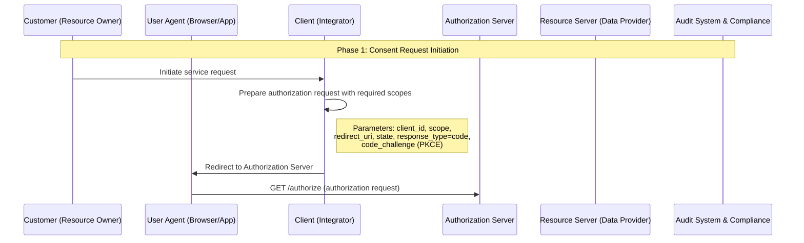
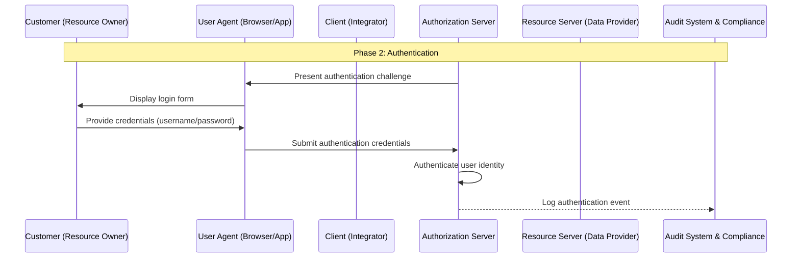
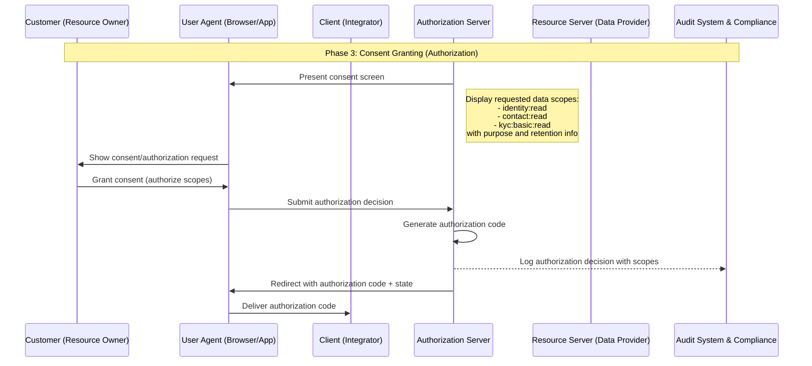
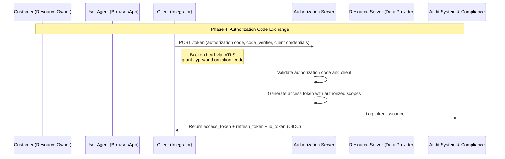
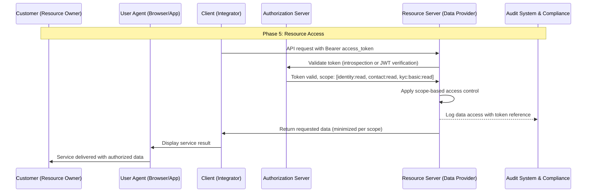
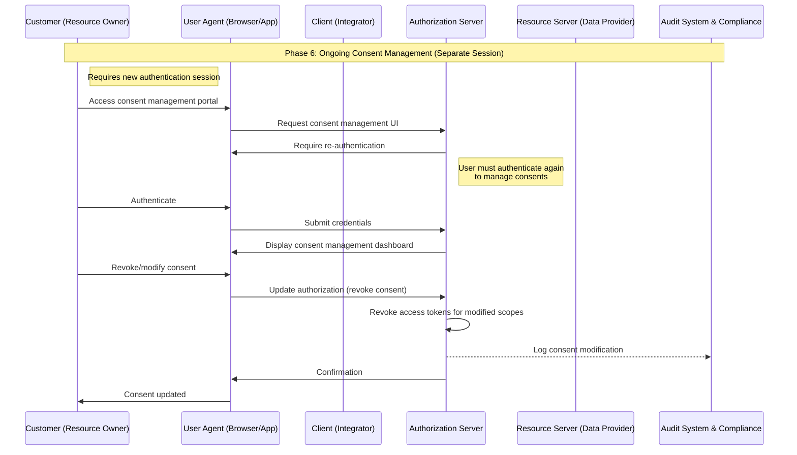

```mermaid
sequenceDiagram
    participant Customer as Customer (Resource Owner)
    participant UserAgent as User Agent (Browser/App)
    participant Client as Client (Integrator)
    participant AuthServer as Authorization Server
    participant DataProvider as Resource Server (Data Provider)
    participant AuditLog as Audit System & Compliance

    Note over Customer,AuditLog: Phase 1: Consent Request Initiation
    Customer->>Client: Initiate service request
    Client->>Client: Prepare authorization request with required scopes
    Note right of Client: Parameters: client_id, scope,<br/>redirect_uri, state, response_type=code,<br/>code_challenge (PKCE)
    Client->>UserAgent: Redirect to Authorization Server
    UserAgent->>AuthServer: GET /authorize (authorization request)
```

```mermaid
sequenceDiagram
    participant Customer as Customer (Resource Owner)
    participant UserAgent as User Agent (Browser/App)
    participant Client as Client (Integrator)
    participant AuthServer as Authorization Server
    participant DataProvider as Resource Server (Data Provider)
    participant AuditLog as Audit System & Compliance

    Note over Customer,AuditLog: Phase 2: Authentication
    AuthServer->>UserAgent: Present authentication challenge
    UserAgent->>Customer: Display login form
    Customer->>UserAgent: Provide credentials (username/password)
    UserAgent->>AuthServer: Submit authentication credentials
    AuthServer->>AuthServer: Authenticate user identity
    AuthServer-->>AuditLog: Log authentication event
```

```mermaid
sequenceDiagram
    participant Customer as Customer (Resource Owner)
    participant UserAgent as User Agent (Browser/App)
    participant Client as Client (Integrator)
    participant AuthServer as Authorization Server
    participant DataProvider as Resource Server (Data Provider)
    participant AuditLog as Audit System & Compliance

    Note over Customer,AuditLog: Phase 3: Consent Granting (Authorization)
    AuthServer->>UserAgent: Present consent screen
    Note right of AuthServer: Display requested data scopes:<br/>- identity:read<br/>- contact:read<br/>- kyc:basic:read<br/>with purpose and retention info
    UserAgent->>Customer: Show consent/authorization request
    Customer->>UserAgent: Grant consent (authorize scopes)
    UserAgent->>AuthServer: Submit authorization decision
    AuthServer->>AuthServer: Generate authorization code
    AuthServer-->>AuditLog: Log authorization decision with scopes
    AuthServer->>UserAgent: Redirect with authorization code + state
    UserAgent->>Client: Deliver authorization code
```

```mermaid
sequenceDiagram
    participant Customer as Customer (Resource Owner)
    participant UserAgent as User Agent (Browser/App)
    participant Client as Client (Integrator)
    participant AuthServer as Authorization Server
    participant DataProvider as Resource Server (Data Provider)
    participant AuditLog as Audit System & Compliance

    Note over Customer,AuditLog: Phase 4: Authorization Code Exchange
    Client->>AuthServer: POST /token (authorization code, code_verifier, client credentials)
    Note right of Client: Backend call via mTLS<br/>grant_type=authorization_code
    AuthServer->>AuthServer: Validate authorization code and client
    AuthServer->>AuthServer: Generate access token with authorized scopes
    AuthServer-->>AuditLog: Log token issuance
    AuthServer->>Client: Return access_token + refresh_token + id_token (OIDC)
```

```mermaid
sequenceDiagram
    participant Customer as Customer (Resource Owner)
    participant UserAgent as User Agent (Browser/App)
    participant Client as Client (Integrator)
    participant AuthServer as Authorization Server
    participant DataProvider as Resource Server (Data Provider)
    participant AuditLog as Audit System & Compliance

    Note over Customer,AuditLog: Phase 5: Resource Access
    Client->>DataProvider: API request with Bearer access_token
    DataProvider->>AuthServer: Validate token (introspection or JWT verification)
    AuthServer->>DataProvider: Token valid, scope: [identity:read, contact:read, kyc:basic:read]
    DataProvider->>DataProvider: Apply scope-based access control
    DataProvider-->>AuditLog: Log data access with token reference
    DataProvider->>Client: Return requested data (minimized per scope)
    Client->>UserAgent: Display service result
    UserAgent->>Customer: Service delivered with authorized data
```

```mermaid
sequenceDiagram
    participant Customer as Customer (Resource Owner)
    participant UserAgent as User Agent (Browser/App)
    participant Client as Client (Integrator)
    participant AuthServer as Authorization Server
    participant DataProvider as Resource Server (Data Provider)
    participant AuditLog as Audit System & Compliance

    Note over Customer,AuditLog: Phase 6: Ongoing Consent Management (Separate Session)
    Note right of Customer: Requires new authentication session
    Customer->>UserAgent: Access consent management portal
    UserAgent->>AuthServer: Request consent management UI
    AuthServer->>UserAgent: Require re-authentication
    Note right of AuthServer: User must authenticate again<br/>to manage consents
    Customer->>UserAgent: Authenticate
    UserAgent->>AuthServer: Submit credentials
    AuthServer->>UserAgent: Display consent management dashboard
    Customer->>UserAgent: Revoke/modify consent
    UserAgent->>AuthServer: Update authorization (revoke consent)
    AuthServer->>AuthServer: Revoke access tokens for modified scopes
    AuthServer-->>AuditLog: Log consent modification
    AuthServer->>UserAgent: Confirmation
    UserAgent->>Customer: Consent updated
```

